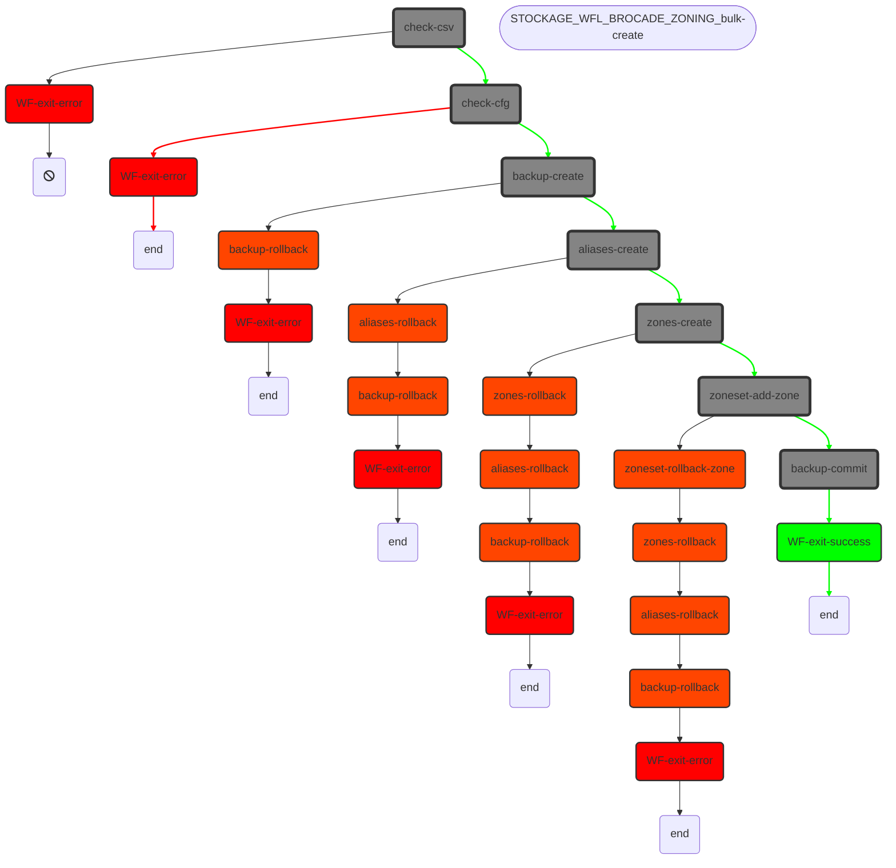

# Flowchart

## Demo

<div class="result" markdown>


```mermaid
flowchart TD

    id1(check-csv)
    id0([STOCKAGE_WFL_BROCADE_ZONING_bulk-create])
    id1 --> id98(WF-exit-error) --> id198(fa:fa-ban)
    id1 --> id2(check-cfg) 
    id2 --> id97(WF-exit-error) --> id197(end)
    id2 --> id3(backup-create) 
    id3 --> id31(backup-rollback) 
    id31 --> id32(WF-exit-error) --> id33(end)
    id3 --> id4(aliases-create) 
    id4 --> id41(aliases-rollback) 
    id41 --> id42(backup-rollback) 
    id42 --> id43(WF-exit-error) --> id44(end)
    id4 --> id5(zones-create) 
    id5 --> id51(zones-rollback) 
    id51 --> id52(aliases-rollback) 
    id52 --> id53(backup-rollback) 
    id53 --> id54(WF-exit-error) --> id55(end)
    id5 --> id6(zoneset-add-zone) 
    id6 --> id61(zoneset-rollback-zone) 
    id61 --> id62(zones-rollback) 
    id62 --> id63(aliases-rollback) 
    id63 --> id64(backup-rollback) 
    id64 --> id65(WF-exit-error) --> id66(end)
    id6 --> id7(backup-commit)
    id7 --> id99(WF-exit-success) --> id199(end)

    linkStyle 3,4 stroke:#ff0000,stroke-width:2px,color:red;
    linkStyle 2,5,9,14,20,27,28,29 stroke:#00ff00,stroke-width:2px,color:green;

    classDef classbox1 fill:#848484,stroke:#333,stroke-width:4px;
    classDef classbox2 fill:#ff4500,stroke:#333,stroke-width:2px;
    classDef classok fill:#00ff00,stroke:#333,stroke-width:2px;
    classDef classerr fill:#ff0000,stroke:#333,stroke-width:2px;
    class id1,id2,id3,id4,id5,id6,id7 classbox1;
    class id97,id98,id32,id43,id54,id65 classerr;
    class id99 classok;
    class id31,id41,id42,id51,id52,id53,id61,id62,id63,id64 classbox2;
```

</div>

## Code

```` markdown title="Flow chart"

```mermaid
flowchart TD

    id1(check-csv)
    id0([STOCKAGE_WFL_BROCADE_ZONING_bulk-create])
    id1 --> id98(WF-exit-error) --> id198(fa:fa-ban)
    id1 --> id2(check-cfg) 
    id2 --> id97(WF-exit-error) --> id197(end)
    id2 --> id3(backup-create) 
    id3 --> id31(backup-rollback) 
    id31 --> id32(WF-exit-error) --> id33(end)
    id3 --> id4(aliases-create) 
    id4 --> id41(aliases-rollback) 
    id41 --> id42(backup-rollback) 
    id42 --> id43(WF-exit-error) --> id44(end)
    id4 --> id5(zones-create) 
    id5 --> id51(zones-rollback) 
    id51 --> id52(aliases-rollback) 
    id52 --> id53(backup-rollback) 
    id53 --> id54(WF-exit-error) --> id55(end)
    id5 --> id6(zoneset-add-zone) 
    id6 --> id61(zoneset-rollback-zone) 
    id61 --> id62(zones-rollback) 
    id62 --> id63(aliases-rollback) 
    id63 --> id64(backup-rollback) 
    id64 --> id65(WF-exit-error) --> id66(end)
    id6 --> id7(backup-commit)
    id7 --> id99(WF-exit-success) --> id199(end)

    linkStyle 3,4 stroke:#ff0000,stroke-width:2px,color:red;
    linkStyle 2,5,9,14,20,27,28,29 stroke:#00ff00,stroke-width:2px,color:green;

    classDef classbox1 fill:#848484,stroke:#333,stroke-width:4px;
    classDef classbox2 fill:#ff4500,stroke:#333,stroke-width:2px;
    classDef classok fill:#00ff00,stroke:#333,stroke-width:2px;
    classDef classerr fill:#ff0000,stroke:#333,stroke-width:2px;
    class id1,id2,id3,id4,id5,id6,id7 classbox1;
    class id97,id98,id32,id43,id54,id65 classerr;
    class id99 classok;
    class id31,id41,id42,id51,id52,id53,id61,id62,id63,id64 classbox2;
```
````