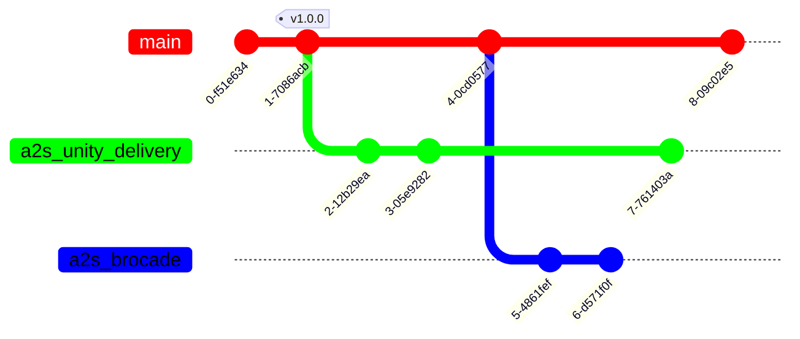
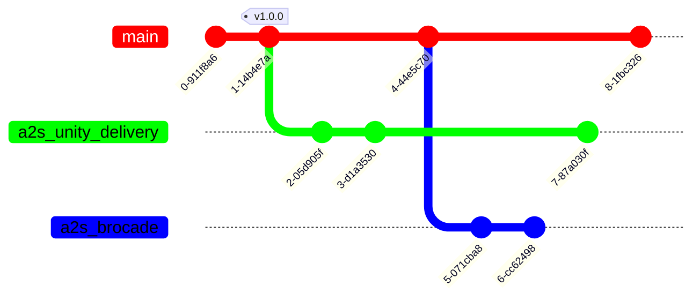
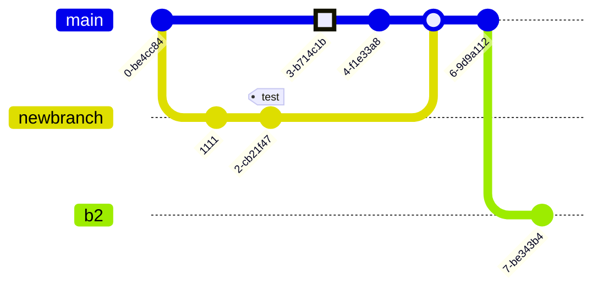
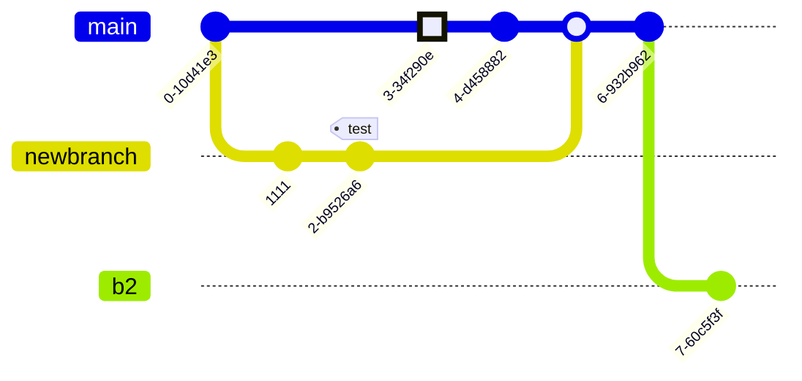

# GitGraph


<div class="result" markdown>


```mermaid
%%{init: { 'logLevel': 'debug', 'theme': 'default' , 'themeVariables': {
              'git0': '#ff0000',
              'git1': '#00ff00',
              'git2': '#0000ff',
              'git3': '#ff00ff',
              'git4': '#00ffff',
              'git5': '#ffff00',
              'git6': '#ff00ff',
              'git7': '#00ffff'
       } } }%%
gitGraph
    commit
    commit tag:"v1.0.0"
    branch a2s_unity_delivery
    commit
    commit
    checkout main
    commit
    branch a2s_brocade
    commit
    commit
    checkout a2s_unity_delivery
    commit
    checkout main
    commit
```

</div>

```` markdown title="Git Graph 1 "

```mermaid
%%{init: { 'logLevel': 'debug', 'theme': 'default' , 'themeVariables': {
              'git0': '#ff0000',
              'git1': '#00ff00',
              'git2': '#0000ff',
              'git3': '#ff00ff',
              'git4': '#00ffff',
              'git5': '#ffff00',
              'git6': '#ff00ff',
              'git7': '#00ffff'
       } } }%%
gitGraph
    commit
    commit tag:"v1.0.0"
    branch a2s_unity_delivery
    commit
    commit
    checkout main
    commit
    branch a2s_brocade
    commit
    commit
    checkout a2s_unity_delivery
    commit
    checkout main
    commit
```
````



```mermaid
gitGraph:
    commit "Ashish"
    branch newbranch
    checkout newbranch
    commit id:"1111"
    commit tag:"test"
    checkout main
    commit type: HIGHLIGHT
    commit
    merge newbranch
    commit
    branch b2
    commit
```

```` markdown title="Git Graph 2"


```mermaid
gitGraph:
    commit "Ashish"
    branch newbranch
    checkout newbranch
    commit id:"1111"
    commit tag:"test"
    checkout main
    commit type: HIGHLIGHT
    commit
    merge newbranch
    commit
    branch b2
    commit
```
````