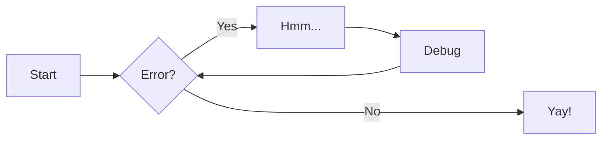

# Graph

## Demo

<div class="result" markdown>


``` mermaid
graph LR
  A[Start] --> B{Error?};
  B --> |Yes| C[Hmm...];
  C --> D[Debug];
  D --> B;
  B ---->|No| E[Yay!];
```

</div>

## Code

```` markdown title="Graph"

```mermaid
graph LR
  A[Start] --> B{Error?};
  B -->|Yes| C[Hmm...];
  C --> D[Debug];
  D --> B;
  B ---->|No| E[Yay!];
```
````