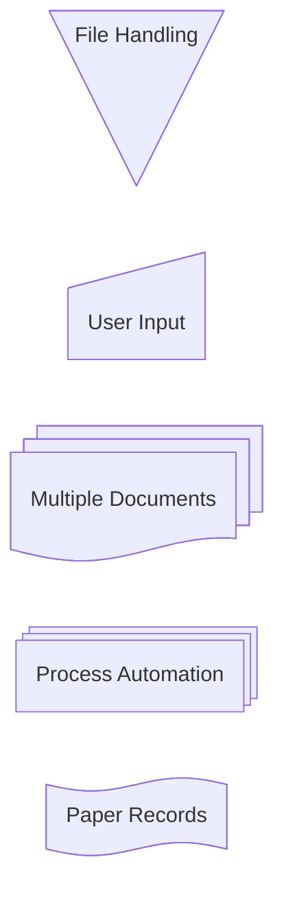
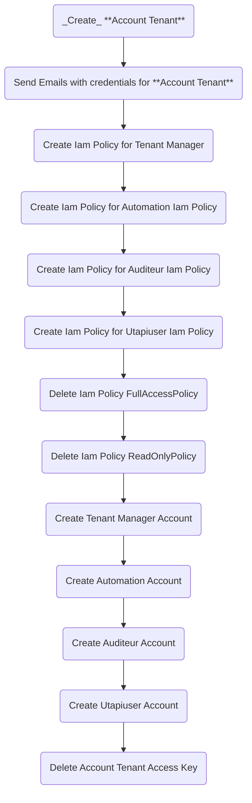

# Test V11

```mermaid

flowchart RL

    A@{ shape: manual-file, label: "File Handling"}

    B@{ shape: manual-input, label: "User Input"}

    C@{ shape: docs, label: "Multiple Documents"}

    D@{ shape: procs, label: "Process Automation"}

    E@{ shape: paper-tape, label: "Paper Records"}

```

```mermaid

%%{ init: {"theme": "default",

           "themeVariables": { "wrap": "false" },

           "flowchart": { "curve": "linear",

                          "markdownAutoWrap":"false",

                          "messageAlign": "center",

                          "wrappingWidth": "600" }

           }

}%%

flowchart TD

id1(_Create_ **Account Tenant**)

id1 --> id2(Send Emails with credentials for **Account Tenant**)

id2 --> id3(Create Iam Policy for Tenant Manager)

id3 --> id4(Create Iam Policy for Automation Iam Policy)

id4 --> id5(Create Iam Policy for Auditeur Iam Policy)

id5 --> id6(Create Iam Policy for Utapiuser Iam Policy)

id6 --> id8(Delete Iam Policy FullAccessPolicy)

id8 --> id9(Delete Iam Policy ReadOnlyPolicy)

id9 --> id10(Create Tenant Manager Account)

id10 --> id11(Create Automation Account)

id11 --> id12(Create Auditeur Account)

id12 --> id13(Create Utapiuser Account)

id13 --> id14(Delete Account Tenant Access Key)

```
