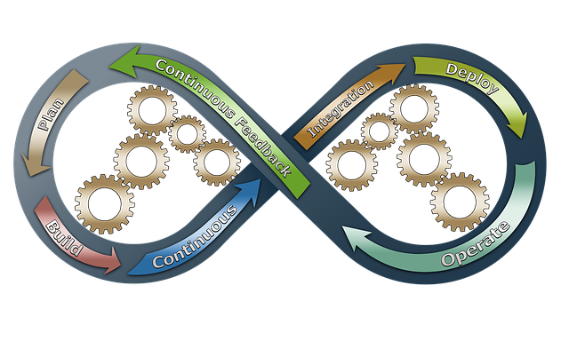

# Syntax Markdown

> **Help Markdown command**_ : <https://commonmark.org/help/>  
> **Tutorial Markdown** : <https://commonmark.org/help/tutorial/>  
> **Editeur Markdown en ligne :**  
Avec l’éditeur WYSIWYG de [stackedit](https://stackedit.io/app#)  
Avec l’éditeur WYSIWYG de [Dillinger](https://dillinger.io/)  
Avec l’éditeur WYSIWYG de [makeareadme](https://www.makeareadme.com/)  

## {++Les Titres++}

* Titre de niveau 1 mettre `un #` devant
* Titre de niveau 2 mettre `deux ##` devant
* etc ... jusqu'au niveau 6

```markdown
# Titre 1
## Titre 2
### Titre 3
```

## {++Typographie++}

### ==Mettre un mot en _italique_==

> _en italique_ .Votre mot se trouve entre 1 `*astérisque*`  
> ou  
> _en italique_ .Votre mot se trouve entre 1 `_underscores_`

### ==Mettre un mot en **en gras**==

> **en gras** .Votre mot se trouve entre 2 `**astérisque**`  
> ou  
> **en gras** .Votre mot se trouve entre 2 `__underscores__`

### ==Mettre un mot en _**en gras et en italique**_==

> _**en gras et en italique**_ . Utilisation conbinée de `_**astérisque et underscores`

### ==Conserver un astérisque (*) ou un underscores (_)==

 `\*astérisque*` ou `\_underscores_`
>
> \*astérisque* => Placer un backslash devant `\*` `\*astérisque*`  
> \_underscores_ => Placer un backslash devant `\_` `\_underscores_`

### ==Encadrer du texte==

<kbd>Encadrer du texte</kbd>

!!! note ""
    => Placer la balise  `<kbd>`Encadrer du texte`</kbd>`

```markdown
<kbd>Encadrer du texte</kbd>
```

### ==Aller à la ligne en fin de phrase==

> Pour faire un  changement de ligne  
> Votre ligne doit se terminer par 2 `espaces`  

!!! note ""
    ou un `\ backslach`  (**Ne fonctionne pas dans cette version de mkdocs**),
    Votre ligne doit se terminer par un backslash ` \ ` pour faire un **retour-chariot**.

## {++Les Listes++}

### ==**Les listes à puces**==

!!! note ""
    Il faut simplement placer un astérisque `* Une Puce`devant les éléments de votre liste.  

* Une puce
* Une autre puce
* Et encore une autre puce !  

```markdown
* Une puce
* Une autre puce
* Et encore une autre puce !
```

### ==**Les listes à case**==

* [ ] Une case
* [x] Une autre case
    * [ ] Et encore une autre case !
  
```markdown
- [ ] Une puce
- [ ] Une autre puce
    - [ ] Et encore une autre puce !
```

!!! note ""
    Il faut simplement placer cette chaine `- [ ]`devant les éléments de votre liste et indenter le code par 4 espaces

### ==**Les listes ordonnées**==

1. Et de un
2. Et de deux
3. Et de trois

!!! note ""
    Il faut simplement placer un nombre `1.` devant les éléments de votre liste.  

```markdown
1. Et de un
2. Et de deux
3. Et de trois
```

### ==**Les listes imbriquées dans une autre**==

* Une puce
* Une autre puce
    * Une sous-puce
        * Une autre sous-puce
* Et encore une autre puce !

!!! note ""
    Il faut simplement placer un astérisque `*` et indenter le code
    par 4 espaces

```markdown
* Une puce
* Une autre puce
    * Une sous-puce
        * Une autre sous-puce
* Et encore une autre puce !
```

### ==**Idem pour une liste ordonnée**==

1. Une puce
2. Une autre puce
    1. Une sous-puce
        2. Une autre sous-puce
3. Et encore une autre puce !

!!! note ""
    Il faut simplement placer un chiffre et indenter le code par 4 espaces

```markdown
1. Une puce
2. Une autre puce
    1. Une sous-puce
        2. Une autre sous-puce
3. Et encore une autre puce !
```

## {++Faire une citation++}

> Ceci est un texte cité. Vous pouvez répondre  
> à cette citation en écrivant un paragraphe  
> normal juste en-dessous !

!!! note ""
    Il vous suffit d'ajouter un `>` devant votre citation.

````markdown
> Ceci est un texte cité. Vous pouvez répondre  
> à cette citation en écrivant un paragraphe  
> normal juste en-dessous !
````

## {++Ecrire du code dans un bloc++}

### ==Bloc de text(1)==

    # code block  
    print '3 backticks or'  
    print 'indent 4 spaces'

!!! note ""
    On peut définir un block de code avec des tabulations (pas pratique)

````markdown
    # code block  
    print '3 backticks or'  
    print 'indent 4 spaces'
````

### ==Bloc de text(2)==

```text
# code block  
print 'Sans espace ou tabulation' 
print 'ici non plus'
```

!!! note ""
    On peut définir un block de code sans tabulations (preférable)

````markdown
```text
# code block  
print 'Sans espace ou tabulation' 
print 'ici non plus'
```
````

### ==Block en BASH==

```bash
cd directory
mkdir newdirectory
```

````markdown
```bash
cd directory
mkdir newdirectory
```
````

### ==Block en YAML==

```yaml
 - name: Import Vars Env for ( Dir, Files )
   include_role:
     name: common
     tasks_from: importVarsDirFiles.yml
```

````markdown
```yaml
  - name: Import Vars Env for ( Dir, Files )
   include_role:
     name: common
     tasks_from: importVarsDirFiles.yml
```
````

### ==Juste un morceau de code==

`<h1>Titre</h1>`

!!! note ""
    Il vous suffit d'entourer votre morceau de code avec deux accents graves.
    Pour faire un accent grave, il vous suffit de faire `AltGr` + `7` sur votre clavier.

````markdown
`<h1>Titre</h1>`
````

## {++LINK++}

## ==Mettre un lien sur stackedit==

Rendez-vous sur [stackedit](https://stackedit.io/app#) !

!!! note ""
    Il vous faut le mot sur lequel vous souhaitez faire votre lien entre crochets [ ], puis votre lien entre parenthèses ( ).

`Rendez-vous sur [stackedit](https://stackedit.io/app#) !`

## {++Les Ancres Nommés++}

## (1) Definir Mon titre avec Ancre <a id=ref_id1></a>

<a id=ref_id2>Un ancre sur un texte</a>

!!! note "Définir un Ancre Titre"
    If suffit de mettre une balise html de type `<a id=ref_id></a>` dans le titre ou un texte

````markdown
## (1) Définir Mon titre avec Ancre<a id=ref_id></a>

<a id=ref_id2>Un ancre sur un texte</a>
````

## [(2) Faire le lien avec une ancre nommé](#ref_id1)

(2) Faire le lien avec un [texte](#ref_id2)

!!! note "Link vers l'ancre"
    Il suffit de créer un `Link` qui poinr vers l'id de l'ancre

````markdown
## [(2) Faire le lien avec une ancre nommé](#ref_id)

(2) Faire le lien avec un [texte](#ref_id2)
````

## {++Tableaux++}

### ==Faire un tableau==

!!! note "Entete"

````markdown
|Colonne 1 Longue |Colonne 2|Colonne 3 Longue|
````

!!! note "Alignement"
    Gauche `|:---|`,
    Centre `|:---:|`,
    Droite `|---:|`

````markdown
|:---|:---:|---:|
````

!!! note "cellule"

````markdown
|Valeur 1|Valeur 2|Valeur 3|
````

> Le tableau final

|Colonne 1 Longue |Colonne 2|Colonne 3 Longue|
|:---|:---:|---:|
|Valeur 1|Valeur 2|Valeur 3|

````markdown
|Colonne 1 Longue |Colonne 2|Colonne 3 Longue|
|:---|:---:|---:|
|Valeur 1|Valeur 2|Valeur 3|
````

## {++Images++}



!!! note ""
    La syntaxe est la même que pour un lien, il suffit juste d'ajouter un point d'exclamation devant les crochets.
!!! note ""
    Ce que vous mettez entre crochet est le texte alternatif de l'image, que nous vous conseillons fortement d'intégrer à chaque fois que vous mettez une image.

````markdown

````

### ==Image Redimentionnée==


!!! note ""
    le parametre **`alt`** est le texte alternatif de l'image, que nous vous conseillons fortement d'intégrer à chaque fois que vous mettez une image.

````markdown

````

## {++Barre de séparation++}

---

!!! note ""
    Pour faire une barre de séparation il vous suffit d'écrire plusieurs `---`

````markdown
---
````
